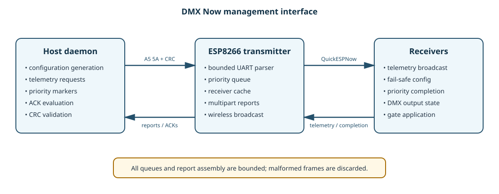

# Management interface

The DMX Now management interface is a binary, CRC-protected control plane that
shares the transmitter UART with the ENTTEC DMX stream. It is intentionally
separate from normal DMX payloads and never emits diagnostic text during normal
operation.



## Frame format

Every host-to-transmitter management frame is:

```text
A5 5A | version | opcode | length low | length high | payload | CRC low | CRC high
```

The CRC is CRC-16/CCITT over `version`, `opcode`, `length`, and `payload`; the
two sync bytes are excluded. The transmitter parser is byte-wise, bounded, and
recovers by searching for the next sync sequence after malformed input.

## Host request opcodes

| Opcode | Name | Payload | Response/behavior |
|---:|---|---|---|
| `0x01` | Get receiver telemetry | empty | Multipart telemetry response. |
| `0x02` | Mark next priority | priority ID, target, repeats, attempt, optional gate mask | Transmitter classifies the next complete ENTTEC universe as priority. |
| `0x03` | Get priority ACKs | empty | Bounded priority ACK report. |
| `0x04` | Clear receiver cache | empty | Clears transmitter telemetry/ACK cache and returns cache-cleared response. |
| `0x05` | Set receiver fail-safe | mode, timeout, generation | Transmitter broadcasts the receiver configuration three times. |

The Python codec is in:

```text
wireless_dmx_daemon/wireless_dmx/transmitter/management.py
```

The shared embedded declarations are in:

```text
libraries/WirelessDMX/src/wireless_protocol.h
```

## Queueing and ordering

The transmitter has separate bounded queues for:

- latest-state normal DMX;
- ordinary management requests;
- priority management markers.

Priority markers are serviced ahead of ordinary management traffic so telemetry
polling cannot silently turn a priority universe into a normal universe. Normal
DMX remains latest-state: a newer unsent universe replaces an obsolete one.

## Telemetry flow

1. The daemon clears the transmitter receiver cache.
2. After the cache-cleared response, it periodically requests telemetry.
3. The transmitter collects receiver broadcasts in a bounded table.
4. A multipart telemetry report is serialized over the host UART.
5. The daemon groups parts by report sequence and validates part indexes before
   publishing receiver state.

Telemetry includes receiver identity, link age, battery state, RSSI, uptime,
universe counters, firmware/protocol versions, telemetry sequence, and fail-safe
configuration/state.

## Priority and ACK flow

The daemon creates a unique priority ID and sends a marker. The transmitter
marks the next complete host universe, sends priority fragments at the priority
cadence, and receives completion packets from receivers. The transmitter stores
ACK records in a bounded ring and exports them when polled.

The daemon evaluates ACKs per event, receiver, and attempt. A hard-gate event is
complete only when every expected receiver reports
`PRIORITY_COMPLETE_GATE_APPLIED`; an ordinary priority ACK is not sufficient.

Repeated physical ACK records are tracked as duplicate records without turning a
successful logical event into a failure.

## Fail-safe configuration flow

The daemon sends a mode, timeout, and generation. The transmitter broadcasts a
packed receiver configuration packet. Receivers accept only valid modes and
timeouts, apply the generation, and echo it through telemetry.

Repeated identical configuration packets are idempotent. A receiver does not
clear active fail-safe state or increment its activation counter merely because
the daemon retransmitted the same configuration.

## Failure handling

- Invalid CRC: frame ignored.
- Oversized management payload: parser resynchronizes without allocation growth.
- Full management queue: operation reports failure; normal DMX queue is not
  evicted.
- Lost telemetry: receiver freshness transitions online → stale → offline.
- Lost priority ACK: bounded retry logic may submit another attempt.
- Transmitter reconnect: cache is cleared and runtime receiver configuration is
  resent.

## Implementation checklist for new commands

When adding a management command:

1. Add host constants and a codec function.
2. Add the embedded opcode and packed payload structure.
3. Validate length, bounds, and CRC on the transmitter.
4. Keep handling non-blocking and bounded.
5. Add parser/CRC/round-trip tests.
6. Document queue priority and response semantics here.